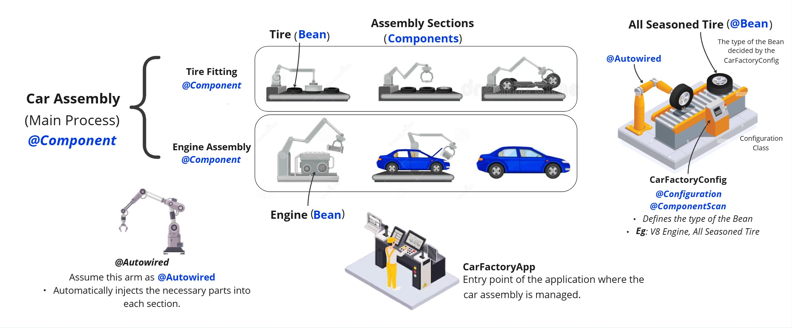

# Car Assembly Example with `@Autowired` in Spring

## Concepts and Logic

### 1. Beans
- Represent different parts of the car.
- **Engine** and **Tire** classes are defined as beans.

### 2. Components
- Represent different sections in the car assembly line.
- **EngineAssembly** and **TireFitting** classes are defined as components.

### 3. Dependency Injection (`@Autowired`)
- Automatically injects the necessary parts into each section.
- Ensures that each section gets the parts it needs without manual intervention.

## Explanation

1. ##### **Define Car Parts (Beans)**
    - **Engine**: Represents the engine part of the car.
    - **Tire**: Represents the tire part of the car.

2. ##### **Define Assembly Sections (Components)**
    - **EngineAssembly**: Manages the engine part of the car assembly.
    - **TireFitting**: Manages the tire part of the car assembly.

3. ##### **Define Car Assembly (Main Process)**
    - **CarAssembly**: Coordinates the overall car assembly process using parts from different sections.

4. ##### **Define Configuration Class**
    - **CarFactoryConfig**: Ensures all sections get the parts automatically.

5. ##### **Main Application**
    - **CarFactoryApp**: Entry point of the application where the car assembly is managed.

